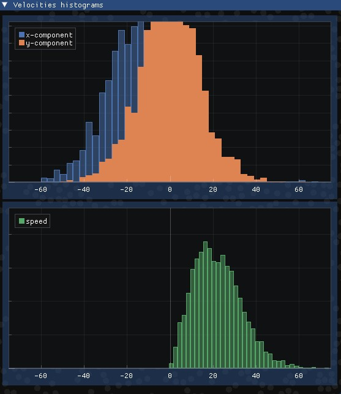

# 2dEC
2d elastic collisions, simple collisions simulation
## General information
This is my first project regarding physic simulation/rendering. I chose this simply model to get familiar with graphic programming. The project isn't big but it was a good fun doing it!
Circles spawn at random location (which do not overlap) with random velocities, they interact via perfectly elastic collisions, due to the model the velocity distribution relaxes to Maxwell–Boltzmann distribution. All circles have the same mass.
## Technologies Used
Project is written in C++ (C++20 for just one thing).\
I used OpenGL, GLEW, GLFW and ImGui for graphics.\
glm for basic vector operations.\
ImPlot for graphs.\
Built in VS 2022.
## Room for Improvement
Maybe I could add different masses.\
I will add more user interface for control over simulation in near future.
## Usage
Simply download, build and run. There are few constants in the code that you can change, e.g. number of circles, their radius.
## Screenshot

